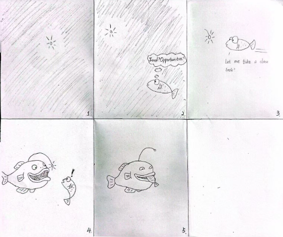
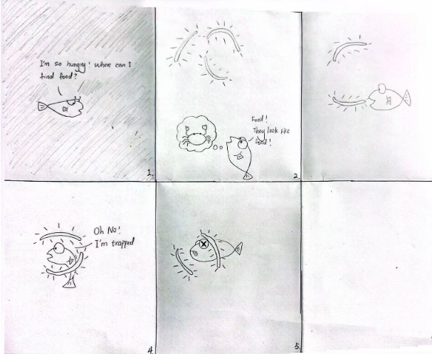
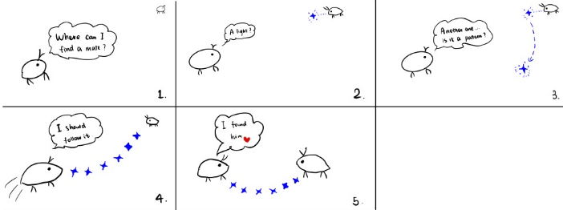
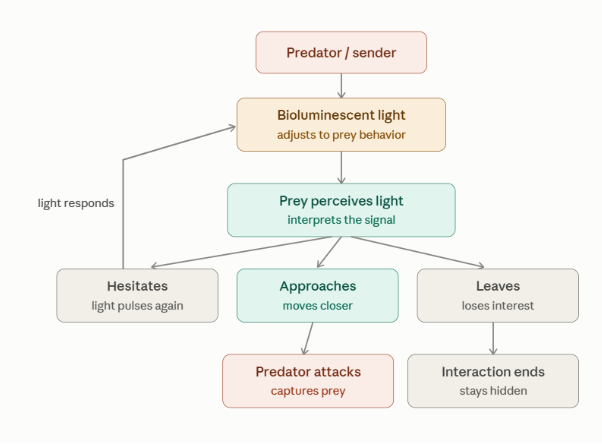
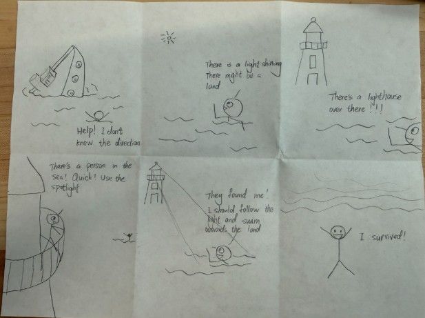
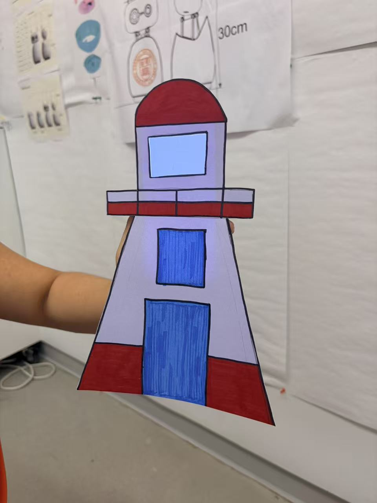

# Recreating the Masters of Interactive Light

_This project is to be done in teams of 2._

**NAME OF BOTH COLLABORATOR(S) HERE**
 Manrong Mao (mm3599), Wenqing Pan(wp273)

**THE MASTERWORK YOU DREW FROM THE HAT:**
Bioluminescent Lures
---

One way to understand greatness is to look to the greats. Just as painters learn
the technique and artistry of the old masters by recreating their paintings, so
too shall we come to understand computer-mediated interaction by recreating the
interactive masterworks of our time.

This week, every team will draw a different masterwork from a hat. Some are
conceptual pieces, some are historical works, some are modern-day products —
but they all share one thing: **their central mode of interaction is carried by
light.** Think of Tinker Bell in the original stage production of *Peter Pan*,
represented by nothing more than a darting circle of light from an off-stage
mirror. There was no actor playing Tinker Bell; she existed entirely through the
way the other characters interacted with that light.

Your job is to recreate the *interaction* of the piece you drew — not to build a
museum-grade replica, but to stage the moment that makes it what it is. Someone
who knows your piece should watch your recreation and recognize it instantly.
Someone who has never heard of it should walk away understanding what it is
famous for.

You will do this using the interaction staging techniques we will use all semester: a
storyboard, some acting, a phone standing in as a controllable light (the
*Tinkerbelle* tool), a hidden human "wizard" driving it, a costume, and a
recorded video.

*Make sure you read all the instructions and understand the whole activity
before starting!*

## Prep

To start, you will need:

1. Read about Git [here](https://git-scm.com/book/en/v2/Getting-Started-What-is-Git%3F).
2. Set up your own Github "Lab Hub" by forking the [Interactive-Lab-Hub repository](https://github.com/IRL-CT/Interactive-Lab-Hub). To get lab updates, simply use [GitHub's "Sync fork" button](https://docs.github.com/en/pull-requests/collaborating-with-pull-requests/working-with-forks/syncing-a-fork) when new content is available.

3. Set up your `README.md` so it has your name and links to this lab. Learn to
   format a README [here](https://docs.github.com/en/get-started/writing-on-github/getting-started-with-writing-and-formatting-on-github/basic-writing-and-formatting-syntax).
4. **Draw your masterwork from the hat and write it at the top of this file.**
   Whatever you drew is yours — lean into it.

## Materials

For this lab you will need:

1. Paper, markers/pens, scissors
2. A smartphone with a browser that can display a webpage (your stand-in "light")
3. A computer to host the control webpage
4. Found objects and materials to **costume your phone so it looks like the
   device in your masterwork** — doll clothes, a paper lantern, a bottle, foil,
   a cardboard shell, whatever it takes. Be resourceful.

## Deliverables

Submit all of the following in this lab folder of your Lab Hub, as links or
uploaded files. **Each group member posts their own copy to their own Github repo**, even if the work is
shared.

1. A short **research write-up** of your masterwork (what it is, when, who made
   it, and — most importantly — what the interaction is)
2. **3 iterated storyboards** of the interaction in the masterwork
5. A **video sketch** of your prototyped interaction
6. Any **reflections** on the process

Labs are due on Mondays. Make sure this page is linked from your main class hub
page.

---

# The Report

## Part 0. Know Your Master

**Describe your masterwork here, in your own words. What is the core interaction
someone would recognize it by?**

Our masterwork is bioluminescent lures: the use of living light to attract, guide, communicate with, or deceive another animal in darkness. Unlike a human-designed device, it has no single inventor or creation date; bioluminescence evolved naturally across many species. Animals use these light signals for different purposes, including hunting, communication, and mating.

One of the most recognizable examples is the deep-sea anglerfish. Female anglerfish have a glowing structure called an esca that acts as a lure. In the darkness of the deep sea, prey notices the small light and may approach to investigate, allowing the hidden anglerfish to attack. Other organisms use light differently. For example, some ostracods produce patterns of light to attract mates.

The main input in this interaction is the behavior of another animal: noticing, approaching, following, or responding to the light. The response is the light-producing animal's next action, such as continuing the signal or attacking. The basic interaction can be described as:

**Light → Attention → Interpretation → Movement → Response**

The main players are the signaler, the receiver, and the dark environment that makes the light highly visible. A major strength of this interaction is that a very small amount of light can strongly influence another animal's behavior without physical contact. However, the signal does not guarantee success—prey may ignore the light or move away if it senses danger. The light can also reveal the signaler’s location to unintended animals. 

For our recreation, we will focus on the anglerfish's most recognizable interaction:

**Darkness → glowing lure → prey notices → prey approaches → predator attacks.**

The core interaction is not simply that the organism produces light, but that the light changes another creature's behavior and draws it closer.

# Part A. Plan

## Storyboard 1 — The Anglerfish: Light as Bait

### Setting

The scene takes place in the deep ocean at night, in near-total darkness. Most of the anglerfish's body is hidden, while its small glowing lure is visible.

### Players

- **Anglerfish / predator**
- **Small fish or crustacean / prey**

### Activity

The anglerfish remains hidden and presents its glowing lure. A small prey animal notices the isolated point of light from a distance.

The prey pauses and looks toward it.

The lure moves slightly.

The prey becomes curious and moves closer.

As the prey approaches, most of the predator remains invisible. Only after the prey enters striking distance does the anglerfish reveal itself and attack.

### Goals

**Anglerfish:** Attract food while minimizing the energy needed to chase prey.

**Prey:** Investigate something that appears interesting or potentially edible.

The two players therefore interpret exactly the same light differently:

- To the predator, it is a hunting tool.
- To the prey, it appears to be an opportunity.

### Storyboard

## Storyboard 2 — The Angler Siphonophore: Light as Disguise

### Setting

The second story also takes place in the deep sea, but instead of one isolated glowing bulb, several small glowing structures hang in the darkness.

### Players

- **Angler siphonophore (*Erenna sirena*)**
- **Fish**

### Activity

The siphonophore hangs glowing lures from its body. The lures resemble small luminous crustaceans or other possible prey.

A hungry fish sees several small glowing objects and interprets them as food.

It follows one of the lights.

Instead of finding prey, the fish moves into range of the siphonophore's tentacles and is captured.

MBARI describes *Erenna sirena* as using luminescent lures that mimic small crimson crustaceans to attract fish toward its tentacles.

### Goals

**Siphonophore:** Make itself appear less like a predator and make its lure appear like something edible.

**Fish:** Find food in an environment where food is difficult to locate.

Unlike Storyboard 1, where the attraction comes largely from curiosity toward a single light, this interaction emphasizes visual deception and mimicry.

### Storyboard

## Storyboard 3 — The Ostracod: Light as a Courtship Message

### Setting

The third story takes place at night in shallow Caribbean water.

### Players

- **Male ostracod**
- **Female ostracod**

### Activity

Instead of using light to capture another animal, the male uses light to communicate.

The male produces a sequence of bioluminescent pulses while moving through the water. The flashes create a recognizable pattern.

A female sees the pattern from a distance.

Rather than reacting to only one bright object, she responds to the timing and arrangement of the signals.

The female recognizes the pattern as belonging to an appropriate potential mate and moves toward the source.

Male ostracods can use species-specific sequences of bioluminescent signals during courtship, allowing females to distinguish their display from other lights in the environment.

### Goals

**Male ostracod:** Become visible to a potential mate and communicate species identity through a recognizable signal.

**Female ostracod:** Locate and identify an appropriate mate.

This storyboard changes the meaning of the light completely. The light is no longer deceptive bait. It becomes a message.

### Storyboard

# Part B. Act out the Interaction

After comparing the three storyboards, we chose **Storyboard 1: the deep-sea anglerfish** because it keeps light at the center of the interaction.

The core sequence is:

**Light appears → prey notices → prey approaches → predator is revealed.**

We acted it out with one person as the prey and the other controlling the lure in a dark room. Two things became clear:

- **The prey needs to hesitate.** If it approaches too quickly, the scene feels scripted rather than interactive.
- **The predator should stay hidden.** Seeing only the lure makes the deception much stronger.

**Better on paper than acted out:** repeated pauses felt too long, so we reduced them to one clear hesitation.

**New idea from acting:** when the prey hesitates, the lure can pulse or move slightly to regain its attention.

**Prey hesitates → lure responds → prey approaches.**

# Part C. Prototype the Light (light first!)

We used the phone light (tinkerbelle) as the anglerfish's glowing lure and we kept controlling its brightness and rhythm through the laptop (jane wren). In a dark room, we kept the light vocabulary simple: off while hidden, a soft white glow to attract attention, a slow pulse when the prey hesitates, and a steadier/brighter glow as it moves closer.

We focused on four qualities: **contrast, brightness, rhythm, and timing.** The lure had to be visible without revealing the predator, feel organic rather than like an alarm, and respond to the prey's movement instead of following a fixed animation.

We deliberately kept the prototype centered on light. The goal was not to reproduce the biology perfectly, but to make one interaction immediately readable: The light makes the prey curious enough to move toward it.

# Part D. Wizard the Device

One collaborator will act as the prey and anglerfish, while the other collaborator secretly controls the Tinkerbelle interface from a computer. The wizard observes the prey’s movement in real time and responds by adjusting the light’s brightness, rhythm, and movement, selecting the appropriate light behavior as the interaction unfolds. 

**Prey enters → Wizard turns lure on**

**Prey notices → Wizard holds steady glow**

**Prey hesitates → Wizard adds a slow pulse**

**Prey approaches → Wizard returns to steady glow**

**Prey reaches striking distance → Predator is revealed**

The wizard always remains outside the camera frame so that the audience experiences the light as if it is independently reacting to the prey.

Our first attempts at recording the wizarded set-up: <https://drive.google.com/file/d/1wOsuRmbmU25wWYsJNgzsgipFuJpKOJGz/view?usp=sharing>

# Part F. Record

### Final Video

<https://cornell.zoom.us/rec/play/Ah_D09KKweKTYq5s5K3NyY1C5qRpGgTvu06cAA9htSGxLLW-9KAvZuzEcbXjNYajkLXIeAFXLkxBmsuT.On3WV0Wt4C12rrLn?accessLevel=meeting&canPlayFromShare=true&from=my_recording&continueMode=true&oldStyle=true&componentName=rec-play&originRequestUrl=https%3A%2F%2Fcornell.zoom.us%2Frec%2Fshare%2FOjL8XTB7Rxzb3IDZaUG28jEE2pqtPNxSOi4gTWKqsvtHTb7Gw2EvSyebjm0AfFYM.MNb5dc2zNoiy-62n>
or
<https://drive.google.com/file/d/1VSOVsDFtMfeOSeoko7Re1CvEbJFDxejj/view?usp=sharing>
Our aim was to make the anglerfish’s hunting interaction immediately understandable. A viewer should be able to recognize how bioluminescent light functions as a lure in the darkness of the deep sea: the prey notices the light, becomes curious, approaches it, and eventually moves close enough for the hidden predator to attack. The key idea we wanted to communicate is that the light is not simply illumination—it is a signal that changes the behavior of another animal.

Non-sequential interaction sketch: The sketch shows the relationship between the anglerfish, its bioluminescent lure, and the prey. The interaction is not completely fixed: the prey may approach, hesitate, or move away. In response, the lure can change its brightness, pulsing frequency, and movement to regain the prey’s attention and encourage it to move closer. This shows the interaction as a responsive loop rather than a fixed sequence.

Collaborators & influences: Wenqing Pan performed both the anglerfish and the prey in the final video. Manrong Mao acted as the hidden wizard, controlling the light’s brightness, pulsing frequency, and movement in response to the prey’s behavior. Together, we used the light to recreate the anglerfish’s bioluminescent hunting strategy in the deep sea.

## Research Sources

- **NOAA Ocean Exploration — “Fishes of the Midnight Zone”**: information about deep-sea environments, anglerfish lures, and the energetic advantage of attracting prey rather than searching for it.
- **MBARI — “Deep-sea anglerfish”**: information about the illicium, esca, glowing bacteria, prey attraction, and anglerfish hunting behavior.
- **MBARI — “Angler siphonophore”**: information about *Erenna sirena* and its luminescent prey-mimicking lures.
- **Smithsonian Ocean — “Bioluminescence”**: examples of bioluminescence used for feeding, communication, and attracting mates.
- **Smithsonian Ocean — “You Light Up My World!”**: information about species-specific ostracod courtship displays.

---

# Part 2 — ReMastering the light

*This describes the second week's work for this lab activity.*

## Prep (before the next lab)

Find three other groups. (How? Maybe Slack?) Visit their Lab Hub pages, watch their
videos, and give them reactions and feedback: tell them what you saw happening,
guess the masterwork and the goals of the characters, and ask about anything that
wasn't clear.

**Who were the other groups you kibitzed with? Add links to their project pages here.**
**Summarize the feedback you got from your partners here.**

## Remix, Update, or Critique the Master

Now that you understand your masterwork from the inside, respond to it. Do the
recreation again, but this time make it your own — pick one of these moves (or
combine them):

1. **Remix the modality.** Your recreation no longer has to (just) use light. Use
   vibration, sound, motion, heat — whatever best carries the interaction. Feel
   free to fork and modify the Tinkerbelle code. (Add your updates to this lab's folder!)
2. **Update it.** Redesign the piece for today's context, or for a setting its
   creators never imagined (the piece with roommates in the room, with children
   present, on a phone, in a car).
3. **Fix its weaknesses.** You identified this master's strengths and weaknesses
   in Part 0 — now address a weakness, or push a strength further.

We will grade this second pass with an emphasis on **creativity** and on how well
your response engages with what your master was really doing.

**Document everything here — especially the storyboard and video. Photos of the
prototype are great too.**

## Storyboard: The Lighthouse: Light as Guidance

### Setting

The story takes place at night along a dark coastline, where a small boat has drifted away from the safe route.

### Players

- **Lighthouse operator**
- **Sailor**

### Activity

Instead of using light to attract another creature toward danger, the lighthouse operator uses light to guide someone toward safety.

When the lighthouse detects the sailor approaching from the wrong direction, it first produces a horn sound to get the sailor's attention.

The lighthouse then directs its beam toward the direction the sailor is coming from. Once the sailor notices the signal, the light shifts to indicate the safer route.

If the sailor hesitates or continues moving in the wrong direction, the lighthouse changes the brightness, rhythm, or direction of the beam to regain attention.

As the sailor begins following the signal, the light continues adjusting to guide them toward safety.

The horn acts as an initial attention signal, while the light provides the actual directional guidance.

### Goals

**Lighthouse Operator:** Gain the sailor's attention and guide the boat away from danger.

**Sailor:** Notice and interpret the light signal in order to find a safe route.

Our lab 2 storyboard keeps the original idea that light changes another character's movement, but changes the relationship completely. The light is no longer a lure that draws someone toward danger. It becomes an adaptive signal that guides someone toward safety.

### Storyboard

## Act out the Interaction

We first acted out the interaction without focusing on the physical appearance of the device. One person played the participant, while the other manually controlled when and how the light appeared.

The core sequence is:

**Sailor miss direction → Sailor finds a light → Sailor tried to approach the light → Lighthouse detects the sailor → horn sounds → light points toward the sailor → light redirects toward safety → sailor follows.**

Acting it out helped us realize that the timing of the light was very important. If the light changed too quickly, the participant did not have enough time to notice or respond to it. If it stayed the same for too long, the interaction felt less responsive.

## Prototype the Light (light first!)

We used **Tinkerbelle** to prototype the light interaction. The smartphone acted as the light source, while the computer running **Jane Wren** was used to remotely control the phone's screen.

We experimented with different levels of brightness, colors, rhythms, and timing to see how each change affected the interaction. Instead of using many complicated effects, we kept the light behavior simple so that each state could be easily recognized.

We focused mainly on **brightness, sound, contrast, movement, and timing.** A steady light was used when the interaction was calm, while changes in brightness or pulsing were used when we wanted the light to attract more attention.

The most important part of the prototype was making the light feel responsive rather than automatic. The light behavior changed based on what the participant was doing instead of simply playing through a fixed sequence.

After getting the light interaction working, we added a short lighthouse horn as a secondary cue. The horn is triggered when the lighthouse first detects the sailor and is used only to attract attention. Once the sailor responds, the light becomes the main communication channel, changing its direction and behavior to guide the sailor toward the safe route.

## Wizard the Device

We created a wizarded setup using **Tinkerbelle** so that one collaborator could interact with the device while the other secretly controlled the light from a laptop.

The wizard watched the sailor's behavior in real time and selected the appropriate light response through the Jane Wren interface.

**Sailor approaches → Wizard triggers the horn**

**Sailor notices the sound → Wizard directs the light toward the sailor**

**Sailor looks toward the lighthouse → Wizard shifts the light toward the safe direction**

**Sailor hesitates → Wizard pulses or strengthens the light**

**Sailor follows the signal → Wizard continues adjusting the light to guide the sailor**

The wizard stayed outside the camera frame so that the lighthouse appeared to detect and respond to the sailor independently. The horn was used as the first attention cue, while the light reacted to the sailor's movement and provided the directional guidance.

## (optional) Costume the Device

After getting the light interaction working, we built a simple **lighthouse model** to give the phone light a physical form.

We created an opening at the top of the lighthouse that was large enough to hold a smartphone. The phone could be placed inside the opening with its screen facing outward, allowing the Tinkerbelle light to shine from the top of the lighthouse.

This setup allowed us to keep using the phone as the actual programmable light while hiding most of the phone inside the model. Instead of seeing a smartphone screen, the audience mainly sees light coming from the top of the lighthouse.

**Phone → placed inside lighthouse → screen produces light → lighthouse appears to glow**

One concern was making sure the opening was large and stable enough to hold the phone without blocking too much of the screen. At the same time, we wanted to hide as much of the phone as possible so that the device would feel more like a physical object rather than a phone placed inside a prop.

An opportunity of this design is that the lighthouse naturally gives the light a clear position and direction. The elevated opening makes the light easier to see, while the physical structure gives the digital light a more recognizable and tangible form.

**Photos of the lighthouse prototype:**

## Record

https://drive.google.com/file/d/1Il1AVOAtaWVdOiKPrSYRJRpgVDk_XcUf/view?usp=sharing

## Feedback from other groups

### 1. Terence Zhang; Jiesen Huang Group

**Link:**  
https://github.com/certaindragon3/Interactive-Lab-Hub/tree/Fall2026/Lab%201

**Feedback:**

I saw a small point of light appear in a completely dark space, and a small fish notice it from a distance. The fish paused and hesitated, and the light pulsed slightly, which pulled its attention back. The fish then moved closer, and once it got close enough, the hidden predator was revealed and the fish was eaten. I think the masterwork is the deep-sea anglerfish and its glowing lure. The anglerfish's goal is to attract food without spending energy chasing it, so it stays hidden and lets the light do the work. The small fish's goal is to investigate something that looks interesting or edible in a place where food is hard to find.

I think the story arc was very clear, and the process of the small fish being tempted and then eaten came across without needing any explanation. The props were also very readable, especially the final moment showing the fish being eaten, which made the ending land. Keeping the predator's body invisible and showing only the lure made the deception much stronger.

Overall I thought it was a very successful interaction. One thing I was not completely clear about was how much of the light's behavior was decided live by the wizard and how much was planned in advance, and whether the person playing the prey knew what the light was going to do next.

---

### 2. Simin Xu & Xiaowei David Zhang Chen Group

**Link:**  
https://github.com/certaindragon3/Interactive-Lab-Hub/tree/Fall2026/Lab%201

**Feedback:**

Your storyboard demonstrates excellent storytelling. Even through a quick reading, we could immediately understand the interaction and how bioluminescent light attracts and influences the prey. The video was also very engaging, and using hand-drawn paper fish made the process visually clear and easy to follow.

For further development, maybe you could focus more deeply on one species, such as the anglerfish, and explore different possible outcomes within its hunting interaction. For example, the prey might approach immediately, hesitate, move away, or become suspicious. The lure could respond differently in each situation by changing its brightness, pulsing rhythm, or movement. Exploring these variations would make the interaction feel more responsive and help the audience gain a deeper understanding of how bioluminescent lures function as a hunting strategy.

---

### 3. Ziqiao Gao, Yan Shen Group

**Link:**  
https://github.com/zg375/Interactive-Lab-Hub/tree/4a6babdbe33db81f0d222dfc877ac0c2b9f3c293/Lab%201

**Feedback:**

By only watching the final video, We definitely recognize the blue fish is a angel fish that had a bioluminescent lures. However we think that the relationship between the glowing biological appendage and the blue fish are kind of confuse, because we don't know what the light are supposed to mean.

We first think the light means it encounter another fish and will be turned off short after, then the lights keep on which we thought it might be off after the blue fish attack the yellow fish. However the light stays on and kinda moves away at the end which looks light the light fell off.

Other than that, we think the video are very well made!

---

*Assignment lineage: this lab merges "Staging Interaction" (Interactive Lab Hub)
with "Recreating the Masters" (Interaction Design Studio, Profs. Scott Minneman &
Wendy Ju). Massive list of interactive light masterworks generated by Claude.ai.*
