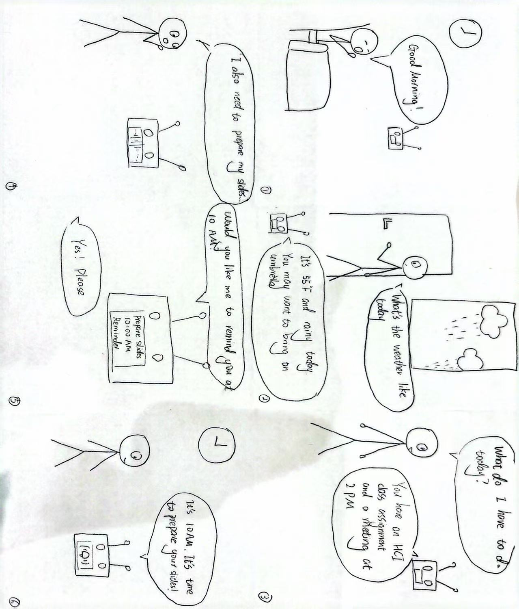
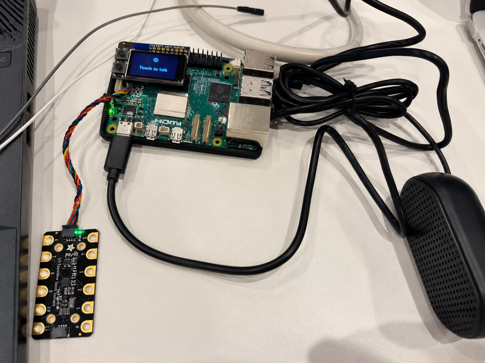
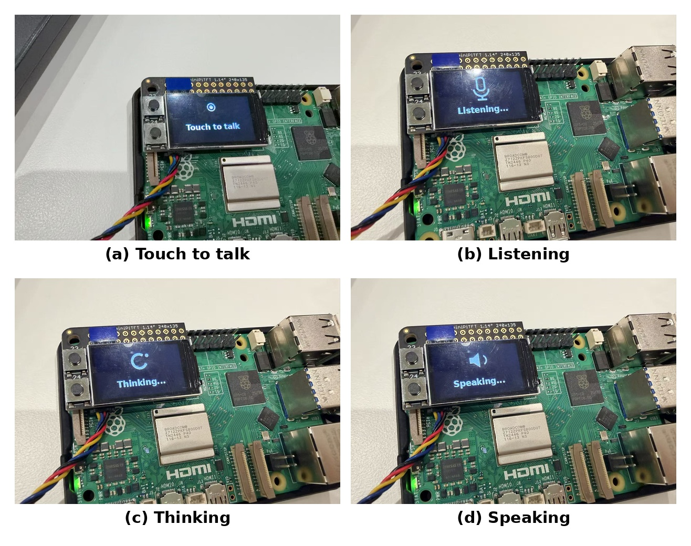

# Chatterboxes

<!-- **NAMES OF COLLABORATORS HERE**

[](https://www.youtube.com/embed/Q8FWzLMobx0?start=19)

In this lab, we want you to design interaction with a speech-enabled device — something that listens and talks to you. This device can do anything *but* control lights (since we already did that in Lab 1). First, we want you to storyboard what you imagine the conversational interaction to be like. Then you will use wizarding techniques to elicit examples of what people might say, ask, or respond. We then want you to use the examples collected from at least two other people to inform the redesign of the device.

We will focus on **audio** as the main modality for interaction to start; these general techniques can be extended to **video**, **haptics** or other interactive mechanisms in the second part of the Lab.

A note on what you are building with. Speech interfaces are usually taught as two boxes — speech-in, speech-out — and that framing hides the part that actually determines whether an interaction works. Between listening and speaking sits the question of **whose turn it is**: when does the device decide you have finished talking, and how long does it make you wait before it answers? This lab gives you direct control over both, and we will ask you to notice what changes when you move them.

## Prep for Part 1: Get the Latest Content and Pick up Additional Parts

Please check instructions in [prep.md](prep.md) and complete the setup.

### Pick up Web Camera If You Don't Have One

Students who have not already received a web camera will receive their Webcam and at the beginning of lab. If you cannot make it to class this week, please contact the TAs to ensure you get these.

### Get the Latest Content

As always, pull updates from the class Interactive-Lab-Hub to both your Pi and your own GitHub repo.

**\[recommended\]** Option 1: On the Pi, `cd` to your `Interactive-Lab-Hub`, pull the updates from upstream (class lab-hub) and push the updates back to your own GitHub repo. You will need the *personal access token* for this.

```
pi@ixe00:~$ cd Interactive-Lab-Hub
pi@ixe00:~/Interactive-Lab-Hub $ git pull upstream Fall2026
pi@ixe00:~/Interactive-Lab-Hub $ git add .
pi@ixe00:~/Interactive-Lab-Hub $ git commit -m "get lab3 updates"
pi@ixe00:~/Interactive-Lab-Hub $ git push
```

Option 2: On your own GitHub repo, create a pull request to get updates from the class Interactive-Lab-Hub. After you have the latest updates online, go to your Pi, `cd` to your `Interactive-Lab-Hub` and use `git pull`.

--- -->

# Part 1

<!-- ## Setup

Create and activate a virtual environment for this lab:

```
pi@ixe00:~$ cd Interactive-Lab-Hub/Lab\ 3
pi@ixe00:~/Interactive-Lab-Hub/Lab 3 $ python3 -m venv .venv
pi@ixe00:~/Interactive-Lab-Hub/Lab 3 $ source .venv/bin/activate
(.venv) pi@ixe00:~/Interactive-Lab-Hub/Lab 3 $
```

Install the Python dependencies:

```
(.venv) $ pip install -r requirements.txt
```

This takes a few minutes. If you would like it to take considerably less time, [`uv`](https://docs.astral.sh/uv/) is a drop-in replacement for `pip` that is dramatically faster on the Pi:

```
(.venv) $ pip install uv && uv pip install -r requirements.txt
```

Then run the setup script, which installs the classic speech synthesizers, downloads the voice activity detection model, and pre-fetches a neural voice and a speech recognition model so you are not waiting on downloads during lab:

```
(.venv):~$ cd speech-scripts
(.venv) $ ./setup.sh
```

Check your audio devices before going further. `arecord -l` lists capture devices and `aplay -l` lists playback devices; if your webcam microphone or Bluetooth speaker does not appear, fix that first — every script below assumes the system defaults are the ones you want. -->

## A. Text to Speech

<!-- Your Pi can speak in several quite different ways, and the differences are audible in a way that matters for design. In `speech-scripts/` there are shell scripts for each.

### The classic engines

```
(.venv) $ cd speech-scripts

(.venv) $ sudo apt update
(.venv) $ sudo apt install -y espeak festival festvox-kallpc16k

(.venv) $ ./espeak_demo.sh
(.venv) $ ./festival_demo.sh
```

You can run these `.sh` files by typing `./filename`, and read one with `cat filename`. You can also play audio files directly with `aplay filename` — try `aplay lookdave.wav`.

These are all decades-old technology and they sound like it. `espeak-ng` is a *formant synthesizer*: it generates speech from an acoustic model of the vocal tract, which is why it sounds robotic but also why the whole thing fits in a couple of megabytes and responds instantly. `festival` is *concatenative*: they stitch together recorded fragments of a real speaker, which sounds more human but breaks audibly at the seams.

### Neural TTS with Piper

Note that the Piper command line changed in version 1.x — voices are now downloaded explicitly with `python3 -m piper.download_voices`, and you invoke it as `python3 -m piper`. Tutorials you find online may show the old `echo ... | piper --model ...` form, which no longer works. Browse the [voice samples](https://rhasspy.github.io/piper-samples) and download a different one if you'd like:

```
(.venv) $ python3 -m piper.download_voices en_US-lessac-medium
```

[Piper](https://github.com/OHF-Voice/piper1-gpl) synthesizes speech with a small neural network, runs comfortably on the Pi 5, and sounds markedly better than the above.

```
(.venv) $ ./piper_demo.sh
```

The demo script also shows `--output-raw`, which streams audio to the speaker as it is generated rather than writing a file first. Listen for the difference in how quickly speech begins. In a conversational system this gap is the thing your user experiences as responsiveness. -->

\*\***Write your own shell file to use your favorite of these TTS engines to have your Pi greet you by name.**\*\*
(This shell file should be saved to your own repo for this lab.)

**My TTS greeting:** [View my greeting shell script](speech-scripts/my_greeting.sh)


\*\***Then answer: Is the same greeting, in these different voices, the same greeting? Describe one concrete way the voice changed what the utterance seemed to mean or who seemed to be speaking.**\*\*

Although the words were the same, the greetings felt quite different because of the voices. eSpeak sounded more distant and mature, which made the speaker feel a little cold or reserved. Festival sounded serious and formal, almost like a news broadcaster, so the greeting felt more like an announcement than a personal interaction. Piper sounded much more natural and conversational, which made the same greeting feel warmer and more personal. This made me realize that even when the words stay exactly the same, the voice can change how I imagine the speaker’s personality and interpret the tone of the message.

## B. Speech to Text

<!-- We use [faster-whisper](https://github.com/SYSTRAN/faster-whisper), a reimplementation of OpenAI's Whisper model that runs several times faster on CPU and does not require PyTorch. All processing happens on the Pi; nothing is sent to a server.

```
(.venv) $ python transcribe.py lookdave.wav
```

The transcript is not the interesting output here — the timings are. Run it again with a larger model and compare:

```
(.venv) $ python transcribe.py lookdave.wav --model base.en
(.venv) $ python transcribe.py lookdave.wav --model small.en
#  noted that the first run may take longer because the model is downloaded, and that the HF unauthenticated-request warning is expected and not an error.
```

Available sizes, smallest first: `tiny.en`, `base.en`, `small.en`, `medium.en`. The `.en` variants are English-only and faster than their multilingual counterparts at the same size.

\*\***Record a few seconds of your own speech (`arecord -d 5 -f cd -c 1 -r 16000 test.wav`) and transcribe it with at least two model sizes. Report the real-time factor for each. At what point does the accuracy improvement stop being worth the delay, for a system that has to answer you?**\*\*

I tested three model sizes on a 5-second recording. tiny.en had a real-time factor of 0.24x, base.en had 0.44x, and small.en had 1.29x. None of the models correctly transcribed my name, “Wenqing”: tiny.en recognized it as “Wendy,” while both base.en and small.en recognized it as “Winti.” The larger models therefore did not provide a meaningful accuracy improvement for this recording, while adding noticeable latency. For a conversational system that needs to respond quickly, I would prefer tiny.en in this case, since increasing the model size did not improve the recognition of my name. -->

\*\***Write your own script that verbally asks for a numerical input (a phone number, zipcode, number of pets) and records the answer the respondent provides.**\*\* Numbers are a good stress test — transcription systems make characteristic errors on digit strings, and you will want to know what they are before you design around them.

I created a script that verbally asks the respondent how many pets they have and records their answer.

[View my numerical input script](speech-scripts/ask_pets.sh)


## C. Turn-taking: knowing when someone has stopped talking

<!-- Everything so far has worked on fixed audio files. A real conversational device does not get told when to start and stop recording — it has to decide. This is the problem that makes speech interfaces hard, and it is mostly not a speech recognition problem.

We use a **voice activity detector** (VAD) to segment the microphone stream into utterances. `listen.py` runs Silero VAD continuously and hands each detected utterance to faster-whisper:

```
(.venv) $ cd speech-scripts
(.venv) $ python listen.py
```

Speak, pause, and watch it transcribe. Now change the endpointing threshold — the amount of silence the system requires before it decides your turn is over:

```
(.venv) $ python listen.py --min-silence 0.2
(.venv) $ python listen.py --min-silence 1.5
``` -->

\*\***Try both extremes, and something in between. Describe what each one feels like to talk to. Note specifically: at 0.2s, what kinds of normal speech get cut off? At 1.5s, what does the delay make the system seem like?**\*\*

There is no correct value. A system that takes drink orders and a system that listens to someone think out loud want very different thresholds, and the right one depends on what your users are doing with their pauses.

At 0.2 seconds, the system felt too sensitive to normal pauses in speech. When I paused briefly while saying “Today I want to... test the speech recognition system,” it treated the pauses as the end of my turn and split the sentence into several separate utterances. At 1.5 seconds, the system was better at keeping my speech together, but the longer wait after I finished speaking made it feel slower and less responsive. Interestingly, during this test, it also transcribed my name “Wenqing” as “Wen T.” This may reflect a speech-recognition error rather than an effect of the silence threshold itself, since the threshold mainly determines when the system considers a turn finished. At 0.7 seconds, the interaction felt more balanced. It successfully captured my full sentence, “I want to test the speech recognition system,” as one utterance while still responding relatively quickly. Overall, 0.7 seconds felt the most natural to me, because it allowed short pauses without making the system feel like it was waiting too long to respond.

<!-- ### The complete loop

`echo_bot.py` puts the pieces together: it listens, endpoints, transcribes, and speaks a reply through Piper. The dialogue policy is deliberately trivial — it repeats what you said — so that everything you notice is a property of the timing rather than the content.

```
(.venv) $ python echo_bot.py
``` -->

## D. Storyboard

<!-- Storyboard and/or use a Verplank diagram to design a speech-enabled device. (Stuck? Make a device that talks for dogs. If that is too stupid, find an application that is better than that.) -->

\*\***Post your storyboard and diagram here.**\*\*

Write out what you imagine the dialogue to be. Use cards, post-its, or whatever method helps you develop alternatives or group responses.

### Storyboard
<p align="center">
  
</p>


### Dialogue Script — Voice-Based Morning Assistant

**Scenario:** The user starts a conversation with a voice-based morning assistant to check the weather, review their daily tasks, organize a new task, and set a reminder.

**User:** Good morning!

**Assistant:** Good morning, Wenqing! How can I help you start your day?

**User:** What’s the weather like today?

**Assistant:** It’s 55°F and rainy today. You may want to bring an umbrella.

**User:** What do I have to do today?

**Assistant:** You have an HCI assignment and a meeting at 2 PM.

**User:** I also need to prepare my slides... *[short pause]* before the meeting.

*The assistant continues listening during the short pause and waits for approximately 0.7 seconds of silence before considering the user’s turn complete.*

**Assistant:** Got it. Would you like to work on the slides this morning?

**User:** Yes, maybe around 10.

**Assistant:** Would you like me to remind you at 10 AM?

**User:** Yes, please.

**Assistant:** Okay. I’ll remind you at 10 AM to prepare your slides.

**Later, at 10:00 AM**

**Assistant:** Wenqing, it’s 10 AM. It’s time to prepare your slides.

**User:** Okay, thanks!


### Interaction Flow

The dialogue moves from **user-initiated information seeking** (weather and daily tasks) to **collaborative planning** (organizing a new task) and finally to **assistant-initiated interaction** (a scheduled reminder).

\*\***Please describe and document your process.**\*\*

Your script should include the pauses. Where does your device wait, and for how long? You now know from Part C that this is a parameter you have to choose, not something that happens for free.

### Design Process

I started by thinking about a typical morning routine and the information I often need at the beginning of the day. I wanted the interaction to go beyond simply asking and answering one question, so I designed the assistant to support three connected tasks: checking the weather, reviewing the day's to-do list, and setting reminders for upcoming tasks.

I designed the conversation to begin with the user rather than having the device speak unexpectedly. After the user says "Good morning," they can naturally move between different needs, such as asking about the weather or checking their schedule. The assistant can also help turn a newly mentioned task into an action by asking whether the user wants to schedule it and set a reminder. The interaction therefore moves from information seeking to planning and finally to a proactive reminder from the assistant.

### Pauses and Turn-Taking

Based on my experiments in Part C, I chose approximately **0.7 seconds of silence** as the default endpointing threshold before the assistant considers the user's turn complete.

At 0.2 seconds, normal pauses in my speech caused the system to divide one sentence into several separate utterances. At 1.5 seconds, the system allowed longer pauses, but the delay after I finished speaking made the interaction feel less responsive. In comparison, 0.7 seconds captured my complete sentence while still responding relatively quickly.

For example, the user might say:

**User:** "I also need to prepare my slides... *[short pause]* before the meeting."

During the short pause, the assistant remains in the listening state rather than immediately responding. It waits until approximately **0.7 seconds of continuous silence** before deciding that the user's turn is complete.

The same endpointing rule is used when the assistant asks questions such as:

**Assistant:** "Would you like me to remind you at 10 AM?"

After asking the question, the assistant waits for the user to respond. Once speech begins, it listens until it detects approximately 0.7 seconds of silence before processing the response.

This design gives users room for natural pauses while thinking or speaking, without making the assistant feel unnecessarily slow.

## E. Acting out the dialogue

<!-- Find a partner, and *without sharing the script with your partner* try out the dialogue you've designed, where you (as the device designer) act as the device you are designing. Please record this interaction (for example, using Zoom's record feature). -->

\*\***Describe if the dialogue seemed different than what you imagined when it was acted out, and how.**\*\*

### Interaction Recording

[Watch the Voice-Based Morning Assistant Role-Play Recording](https://drive.google.com/file/d/1SirT_DyhYUl3ozeDQBnCP96O-FhWqpXk/view?usp=sharing)

### Reflection

The acted-out dialogue was different from what I originally imagined in several ways.

First, the user sometimes made evaluative or conversational comments rather than only giving direct responses. For example, after hearing the to-do list, the user said, “That’s not too much.” I had not included this type of response in my original script. This made me realize that users may treat a voice assistant as a conversational partner rather than simply following a question-and-answer structure.

Second, I noticed that the same intent can be expressed in many different ways. For example, a user might ask “What should I do today?” or “What is my to-do list today?” to request essentially the same information. My original dialogue only included one phrasing for each request, but a real speech interface would need to recognize different expressions of the same intent.

Finally, the user asked about the time associated with tasks on the to-do list, which I had not anticipated in my original dialogue. Instead of simply listening to the list, the user wanted to know when a particular task was scheduled. This suggests that the assistant should support follow-up questions about information it has just provided, such as the time, priority, or details of a task.

Overall, acting out the dialogue showed me that real conversations are less predictable and more flexible than a scripted interaction. In a future iteration, I would design the assistant to handle conversational comments, multiple ways of expressing the same intent, and contextual follow-up questions about previously mentioned tasks.


---

# Lab 3 Part 2

For Part 2, you will redesign the interaction with the speech-enabled device using the data collected, as well as feedback from part 1.

## Prep for Part 2

1. What are concrete things that could use improvement in the design of your device? For example: wording, timing, anticipation of misunderstandings.


- **Wording:** Use more natural and flexible phrasing. The device should support different ways of asking the same question, such as “What’s my to-do list today?” or “What should I do today?”

- **Handling follow-up questions:** Allow users to ask for more details about information that was previously mentioned, such as the time of a task (“When is the meeting?”), without requiring them to repeat the full context.

- **Anticipating misunderstandings:** If the user’s input is unclear or not recognized correctly, the device should ask a clarifying question instead of giving an irrelevant or potentially incorrect response.


2. What are other modes of interaction *beyond speech* that you might also use to clarify how to interact? In particular: how does someone know when the device is listening, and when it is thinking? You have a screen and an LED.

In Part 1, the interaction relied almost entirely on speech, which made the device’s internal state unclear. The user could not easily tell when the assistant was listening, when it had decided that the user was finished speaking, or when it was processing a response.

For Part 2, I added touch and visual feedback as additional interaction modes. The assistant is no longer always listening. Instead, the user touches a capacitive sensor to initiate each interaction. When the device is idle, the screen displays “Touch to talk.” After the touch is detected, the device begins listening. This gives the user explicit control over when a conversation turn starts.

The screen then provides continuous feedback about the assistant’s state. While the user is speaking, it displays a microphone icon and “Listening...”. After the speech turn ends and the assistant is processing the input, the screen changes to a circular icon and “Thinking...”. When the assistant responds, it shows a speaker icon and “Speaking...”, and a reminder uses a separate bell icon. 

These visual states make turn-taking more explicit: touch means “I want to speak,” Listening means “speak now,” Thinking means “wait,” and Speaking means “listen to the assistant.” This reduces the ambiguity that existed in the speech-only design from Part 1.

3. Make a new storyboard, diagram and/or script based on these reflections.
4. (optional) Integrate [input devices](inputs.md) in the system

## Prototype your system

<!-- The system should:
* use the Raspberry Pi
* use one or more sensors
* require participants to speak to it

*Document how the system works.*

*Include videos or screencaptures of both the system and the controller.* -->

I implemented the redesigned Morning Assistant as a functional prototype using a Raspberry Pi, a capacitive touch sensor, a screen, microphone input, and speech output.

### How the System Works

I implemented the redesigned Morning Assistant as a functional prototype using a Raspberry Pi, a capacitive touch sensor, a screen, microphone input, and speech output.



**Figure 1. Physical setup of the Morning Assistant.** The prototype consists of a Raspberry Pi with a screen for visual feedback, an MPR121 capacitive touch sensor for initiating interaction, and audio input/output for speech-based interaction.

As shown in **Figure 2**, the screen provides visual feedback for each stage of the interaction. The interaction follows this sequence:

1. **Idle (Figure 2a):** The device waits for the user to initiate an interaction. The screen displays “Touch to talk.”

2. **Touch to activate:** The user touches the capacitive sensor (pad 6) to activate the assistant. This prevents the device from continuously listening and gives the user control over when an interaction begins.

3. **Listening (Figure 2b):** After the touch is detected, the microphone begins listening. The screen displays a microphone icon and “Listening...” so the user knows when to speak.

4. **Thinking (Figure 2c):** When the user finishes speaking, the system transcribes and processes the request. The screen changes to a circular processing icon and “Thinking...” to indicate that the user should wait.

5. **Response (Figure 2d):** The assistant responds through speech. The screen displays a speaker icon and “Speaking...” while the response is being played.

6. **Return to idle:** After responding, the device returns to the “Touch to talk” state and waits for the next interaction.



**Figure 2. Multimodal interaction states of the redesigned Morning Assistant.** 
(a) “Touch to talk” indicates that the device is idle; 
(b) “Listening” indicates that the user can speak; 
(c) “Thinking” indicates that the request is being processed; and 
(d) “Speaking” indicates that the assistant is delivering its response.

### Interaction Flow

`Touch sensor → Listening → Speech recognition → Thinking → Intent/task processing → Spoken response → Idle`

### Participant Testing

I tested the prototype with two participants to observe how people interacted with the touch-to-talk mechanism, visual state feedback, and conversational assistant.

**Participant 1:**  
[Watch Participant 1 Testing Video](https://drive.google.com/file/d/1_Sofrh06lzBpOJN-KG5y9Eo3wp-9LeCE/view?usp=sharing)

**Participant 2:**  
[Watch Participant 2 Testing Video](https://drive.google.com/file/d/1HcuUAD7mrQXC-M_KllQMqEZL2sd5rwfS/view?usp=sharing)

## Test the system

<!-- Try to get at least two people to interact with your system. (Ideally, you would inform them that there is a wizard *after* the interaction, but we recognize that can be hard.)

Answer the following: -->

### What worked well about the system and what didn't?
**What worked well:**  
The system successfully supported several useful daily-assistant functions:

- **Time:** It could tell users the current time when asked.
- **Weather:** It could provide weather information for the current day as well as a future day, including temperature and the probability of rain.
- **Task management:** Users could tell the assistant about future tasks, appointments, classes, or deadlines, and the system could save these items for later.
- **Plan retrieval:** After tasks were saved, users could ask questions such as “What do I need to do tomorrow?” and the assistant could retrieve and summarize the previously recorded plans.
- **Multiple tasks:** The system could store multiple items in the user's plan rather than being limited to a single task.
- **Reminders:** Users could ask the assistant to create time-based reminders, and the system could notify them when the scheduled time was reached.
- **Interaction feedback:** The touch-to-talk interaction gave users control over when the device started listening. The screen also clearly communicated the current state through “Touch to talk,” “Listening,” “Thinking,” and “Speaking” feedback.

Overall, the prototype was able to support a basic conversational workflow in which users could provide information, have the system remember it, and later retrieve or act on that information.

**What didn't work well:**  
The reminder feature was less reliable when recognizing certain spoken time expressions. For example, a time such as “9:05” could sometimes be transcribed as “9 or 5,” causing the system to misunderstand the intended reminder time. Similar speech-recognition errors could make reminder creation fail even when the user's request was otherwise clear. A future version could improve this by confirming the interpreted time before saving the reminder, for example, “Did you mean 9:05 PM?”

### What worked well about the controller and what didn't?
**What worked well:**  
The capacitive touch sensor provided a simple and clear way for users to initiate an interaction. Instead of having the device continuously listen, users could touch the sensor whenever they wanted to speak. This gave users more control over the interaction and made it clearer when the device would start listening. The touch sensor also worked reliably during testing and responded quickly when participants touched it.

**What didn't work well:**  
The controller requires users to touch the sensor before every speaking turn, which can become repetitive during a longer conversation. Users may also forget to touch the sensor before speaking, especially after the assistant responds, because they may naturally expect the conversation to continue. If they start speaking without touching the sensor, the device will not listen or respond. 

### What lessons can you take away from the WoZ interactions for designing a more autonomous version of the system?

The WoZ interactions showed me that real conversations are much less predictable than a predefined script. Users may express the same intent in many different ways, ask follow-up questions that I did not anticipate. Therefore, a more autonomous system should not depend too heavily on exact keywords or fixed sentence structures.

I also learned that the system needs to maintain conversational context. For example, after hearing a to-do list, a user may ask “When is the meeting?” without repeating the full task or date. The autonomous version should remember information from previous turns and use it to interpret follow-up questions.

Finally, the system should be designed to handle uncertainty rather than assuming it understood the user correctly. If important information such as a reminder time is missing or unclear, it should ask a specific clarification question or confirm its interpretation before taking action. These lessons informed my Part 2 prototype by adding more flexible intent handling, short-term conversation state, and clarification for incomplete requests.

### How could you use your system to create a dataset of interaction? What other sensing modalities would make sense to capture?

The system could create an interaction dataset by logging each user session, including the user’s transcribed speech, the detected intent (such as adding a task, asking about a plan, checking the weather, or setting a reminder), the system’s response, and timestamps for each interaction. It could also record whether the system successfully completed the request or needed clarification. Over multiple users and sessions, this could create a dataset showing the different ways people express the same intent, common speech-recognition errors, and situations in which misunderstandings occur.

Additional sensing modalities could provide more context about the interaction. For example, proximity sensing could detect whether someone is near the device before it provides information or reminders. A camera could also capture nonverbal behaviors such as whether users are looking at the screen or appear confused, although this would require careful consideration of privacy and consent. Combining speech, touch, timing, and contextual sensor data could help identify where interactions succeed or break down and inform future improvements to the system.

<details>
  <summary><strong>Submission Cleanup Reminder (Click to Expand)</strong></summary>

  **Before submitting your README.md:**
  - This readme.md file has a lot of extra text for guidance.
  - Remove all instructional text and example prompts from this file.
  - You may either delete these sections or use the toggle/hide feature in VS Code to collapse them for a cleaner look.
  - Your final submission should be neat, focused on your own work, and easy to read for grading.
</details>
